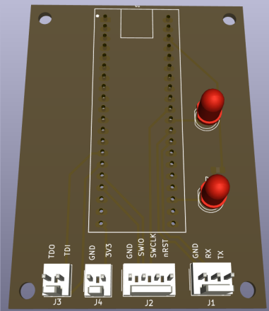

# Black Magic Probe (BMP) Hardware Adapter

This documentation describes the hardware schematic for configuring an STM32 BlackPill as a Black Magic Probe (BMP) debugger. This design breaks out the essential debug and serial interfaces necessary for flashing and interacting with embedded targets.

## Schematic Overview

The schematic details the pin routing from the BlackPill's microcontroller to dedicated external connectors, providing a unified interface for hardware debugging.

### Exposed Debug & Serial Interfaces

The following critical signals are exposed for target interaction:
*   **Serial Wire Debug (SWD):** `SWDIO` and `SWCLK`.
*   **JTAG Interface:** `TDI` and `TDO`.
*   **UART Bridge:** `TX` and `RX` lines for target serial communication.
*   **Control & Power:** Target reset (`RST`), `+3.3V`, and `GND`.

### Hardware Connectors
The design organizes these signals into specific pin headers for modular target connections:
*   **J1:** Groups a 3-pin interface, likely designated for the UART bridge or basic target control.
*   **J2:** The primary 4-pin debug header, exposing the SWD/JTAG signaling lines.
*   **Auxiliary Connectors:** Multiple 2-pin connectors utilized for power delivery (`+3.3V`, `GND`) and other localized signal pairs.

### Status Indicators

The schematic includes visual indicators to monitor the probe's state during execution:
*   **D1 (Status LED):**  Pin `PC14`, typically used for general error or operational status indication
.
*   **D2 (UART LED):** Providesvisual feedback for serial bridge activity (TX/RX traffic).

